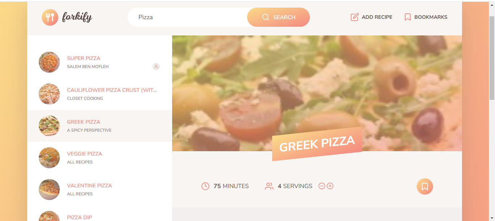

# Forkify

Forkify is a web application that allows users to search for and share cooking recipes. It features a simple and interactive user interface where users can input specific ingredients to find suitable recipes. Forkify utilizes modern JavaScript techniques and an API to retrieve recipe data, enabling the display of detailed information, including ingredients, instructions, and images.

## Table of Contents

- [Demo](#demo)
- [Screenshot](#screenshot)
- [Features](#features)
- [Technologies Used](#technologies-used)
- [Usage](#usage)

## Demo

You can view a live demo of the project [here](https://salem-forkify-7ee33d.netlify.app/).

## Screenshot

## Features

- Search for recipes using specific ingredients.
- Display recipe details, including ingredients and steps.
- Interactive and user-friendly interface.
- Ability to save favorite recipes in a personal list.

## Technologies Used

- HTML
- CSS
- JavaScript

## Usage

1. Search for any recipes

- Example: `Pizza`

2. Explore the various features of the application, such as adding your recipes, viewing your recipes, adding a recipe to favorites, viewing favorite recipes, and removing a favorite recipe
